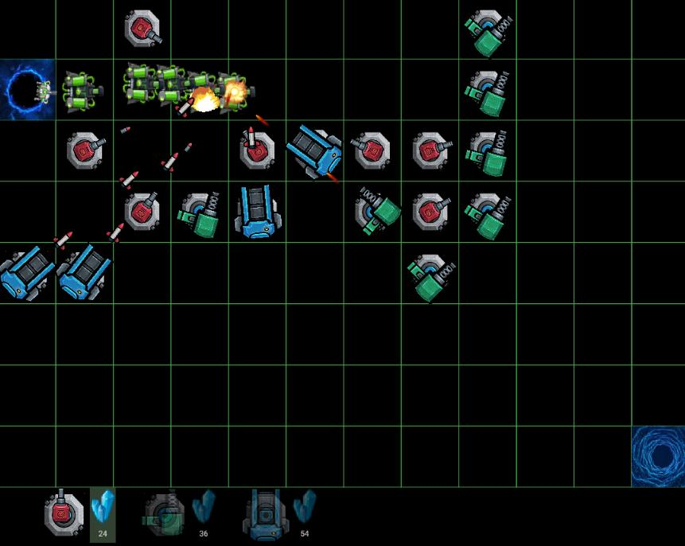

# td
 from https://github.com/cloudseasail/free_defense  
 

 
 FreeDefense Game with Flutter and Flame.



## DEMO: [Web version for V0]  
[Web version] http://freedefense.vquant.ml/

Controls:
- Click:  preview the weapon.  (donot block the enemies!)
- Click again: build weapon.
- Clink on weapon,  update and destroy the weapon
- Collect mine to build weapon

 
 
 
 
 license GNU General Public License v3.0	gpl-3.0
 
 
# sound explosions 
```
© Mattis Flettner (mattflat), 2021

License: CC BY-ND 3.0 - https://creativecommons.org/licenses/by-nd/3.0/

You can use the assets for free (even commercially), if you give credit to me and, preferably, my itch.io site: https://mattflat.itch.io/

35 sound effects for games with guns, explosions, tanks, etc. (for example RTS, FPS, ...)

I made these sounds for my game "6 APM" - available for free: https://mattflat.itch.io/6apm
Feel free to use them in your next game!


Feedback is always welcome: mattflat@mail.de
```
